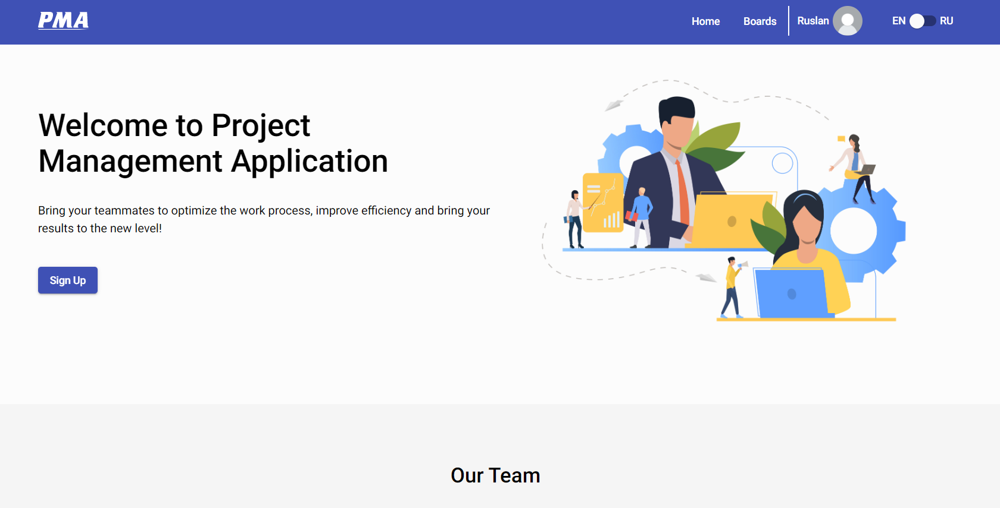

# Project Management App

What it is:

This is a web application like kanban board that allows us to manage projects workflows. If you login successfully to the app, you can create boards and task and assign to the right users.

Installation:
To build, download the files from the repository and install the dependencies use npm: npm install. After that, type 'npm run start' in console to run application in development mode, or 'npm run build' to get built bundle (appears in dist folder).

Deployed version you can find [here](https://sadullo-project-management-app.netlify.app/).

Backend repo: [kanban-rest](https://github.com/Sadullo1992/kanban-rest).
Backend deploy: [https://murmuring-headland-53952.herokuapp.com/](https://murmuring-headland-53952.herokuapp.com/).

Technologies: Angular, TypeScript, RxJs, SCSS

Technical features:

- Auth form implemented with form validation
- Create boards and tasks
- Move tasks throught boards
- Create, delete, edit boards and tasks...
